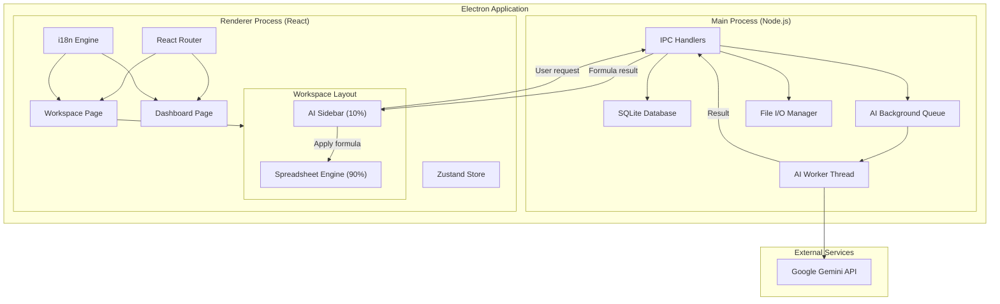
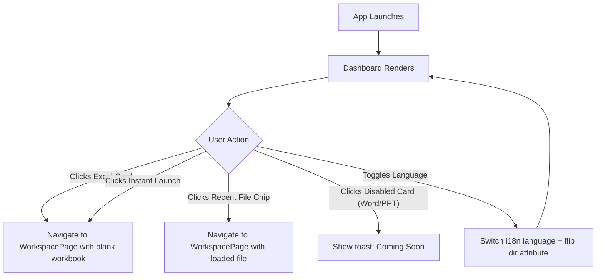
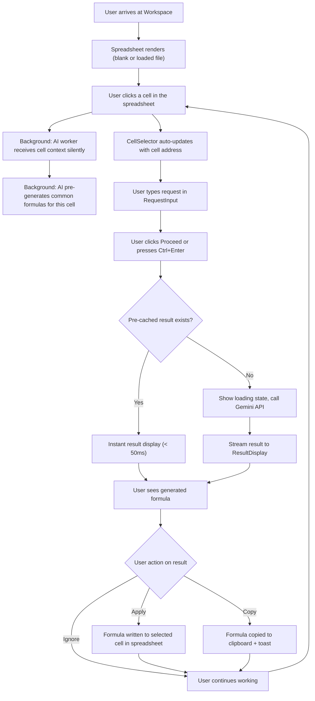
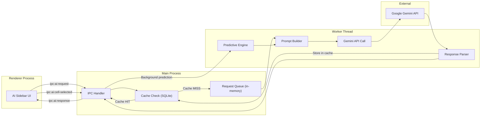
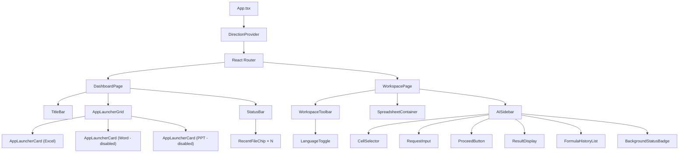

# OmniWork AI — Product Requirements Document (PRD)

> **Version**: 1.0.0  
> **Date**: 2026-10-07  
> **Status**: DRAFT — Awaiting Approval  
> **Platform**: Windows Desktop (Electron)  
> **Languages**: کوردیی ناوەندی (Central Kurdish / Sorani — RTL) + English (LTR)

---

## Table of Contents

1. [Project Overview](#1-project-overview)
2. [Vision & Goals](#2-vision--goals)
3. [Target Users](#3-target-users)
4. [Technology Stack](#4-technology-stack)
5. [System Architecture](#5-system-architecture)
6. [Complete Project File Structure](#6-complete-project-file-structure)
7. [Screen 1 — Main Dashboard](#7-screen-1--main-dashboard)
8. [Screen 2 — Excel Workspace with AI Sidebar](#8-screen-2--excel-workspace-with-ai-sidebar)
9. [AI Backend Engine](#9-ai-backend-engine)
10. [Internationalization (i18n) — Kurdish RTL & English LTR](#10-internationalization-i18n--kurdish-rtl--english-ltr)
11. [UI/UX Design System](#11-uiux-design-system)
12. [Component Architecture](#12-component-architecture)
13. [State Management](#13-state-management)
14. [IPC Communication (Main ↔ Renderer)](#14-ipc-communication-main--renderer)
15. [Database Schema](#15-database-schema)
16. [AI API Integration](#16-ai-api-integration)
17. [Error Handling Strategy](#17-error-handling-strategy)
18. [Performance Requirements](#18-performance-requirements)
19. [Security Requirements](#19-security-requirements)
20. [Testing Strategy](#20-testing-strategy)
21. [Build & Deployment](#21-build--deployment)
22. [Future Extensibility (Phase 2+)](#22-future-extensibility-phase-2)
23. [Complete Translation Dictionary](#23-complete-translation-dictionary)

---

## 1. Project Overview

**OmniWork AI** is a Windows desktop application built with Electron that provides a unified productivity workspace. Users launch everyday office applications (starting with Excel) from a clean central dashboard. When an application is launched, a full-featured spreadsheet editor occupies 90% of the screen, while an intelligent AI sidebar occupies the remaining 10%. The AI sidebar allows users to select cells, describe what they want in natural language, and receive generated Excel formulas, data transformations, and analysis — all while an AI backend works silently in the background to pre-process and cache results for instant perceived performance.

### What This Project IS (Phase 1 — MVP)
- A Windows desktop application (`.exe` installer)
- A built-in spreadsheet editor (using Univer library) that replicates Excel's core functionality
- An AI-powered sidebar that generates Excel formulas from natural language
- Bilingual interface: Central Kurdish (RTL) and English (LTR)
- Background AI processing for instant perceived response times
- Ability to import/export `.xlsx`, `.xls`, and `.csv` files

### What This Project is NOT (Phase 1)
- NOT a web-hosted SaaS (it is a desktop app)
- NOT embedding the actual Microsoft Excel process (it uses a web-based spreadsheet engine)
- NOT including Word or PowerPoint yet (Phase 2+)
- NOT requiring internet for spreadsheet editing (AI features require internet)

---

## 2. Vision & Goals

| Goal | Metric |
|------|--------|
| Launch to dashboard in under 2 seconds | Cold start < 2s |
| Spreadsheet opens in under 1 second | Sheet render < 1s |
| AI response perceived as instant | Background pre-processing; visible response < 500ms after "Proceed" click |
| Kurdish-first bilingual UX | Full RTL layout with zero broken alignment |
| Professional, simple, clean UI | Glassmorphism design system with consistent spacing |

---

## 3. Target Users

- Kurdish-speaking office workers in Kurdistan Region / Iraq
- Small-to-medium business employees who use Excel daily
- Users who want AI assistance with Excel formulas without learning formula syntax
- Bilingual (Kurdish/English) professionals

---

## 4. Technology Stack

| Layer | Technology | Version | Purpose |
|-------|-----------|---------|---------|
| Runtime | Electron | ^33.x | Desktop app shell |
| Frontend Framework | React | ^19.x | UI components |
| Language | TypeScript | ^5.7 | Type safety |
| Build Tool | Vite | ^6.x | Fast bundling for Electron renderer |
| Electron Builder | electron-builder | ^25.x | Packaging & distribution |
| Spreadsheet Engine | @univerjs/core + @univerjs/sheets + @univerjs/sheets-ui + @univerjs/ui | ^0.6.x | Full Excel-like spreadsheet |
| Styling | Tailwind CSS | ^4.x | Utility-first CSS |
| State Management | Zustand | ^5.x | Lightweight global state |
| i18n | react-i18next + i18next | ^15.x / ^24.x | Bilingual RTL/LTR |
| AI Provider | Google Gemini API (`@google/generative-ai`) | ^0.24.x | Formula generation |
| Local Database | better-sqlite3 | ^11.x | User preferences, history, cache |
| File I/O | @univerjs/sheets-import-export | ^0.6.x | .xlsx / .csv import/export |
| Icons | Lucide React | ^0.468.x | Clean consistent iconography |
| Font (Kurdish) | Noto Sans Arabic | — | RTL font support |
| Font (English) | Inter | — | Clean LTR font |
| Testing | Vitest + @testing-library/react + Playwright | — | Unit + Integration + E2E |

---

## 5. System Architecture



### Process Architecture

1. **Main Process** (Node.js): Handles file system access, SQLite database, AI API calls via a dedicated Worker Thread, and all IPC communication.
2. **Renderer Process** (Chromium): Runs the React application with the dashboard, spreadsheet engine, and AI sidebar.
3. **AI Worker Thread** (Node.js `worker_threads`): A dedicated background thread that:
   - Receives user requests from the main process
   - Calls the Gemini API
   - Pre-processes predictive suggestions in the background (e.g., when a user selects a cell, the worker silently analyzes surrounding data and pre-generates common formulas)
   - Returns results to the main process, which forwards them to the renderer via IPC

---

## 6. Complete Project File Structure

```
omniwork-ai/
├── package.json
├── tsconfig.json
├── tsconfig.node.json
├── electron-builder.yml
├── vite.config.ts
├── tailwind.config.ts
├── postcss.config.js
├── .env.example                         # GEMINI_API_KEY=your_key_here
├── .env                                 # (gitignored) actual keys
├── .gitignore
├── README.md
│
├── resources/                           # Electron packaging resources
│   ├── icon.ico                         # App icon (Windows)
│   ├── icon.png                         # App icon (256x256)
│   └── installerSidebar.bmp            # Installer sidebar image
│
├── src/
│   ├── main/                            # Electron Main Process
│   │   ├── index.ts                     # Main entry: creates BrowserWindow, registers IPC
│   │   ├── ipc/
│   │   │   ├── index.ts                 # Register all IPC handlers
│   │   │   ├── ai.ipc.ts               # IPC handlers for AI requests
│   │   │   ├── file.ipc.ts             # IPC handlers for file open/save dialogs
│   │   │   ├── db.ipc.ts               # IPC handlers for database operations
│   │   │   └── app.ipc.ts              # IPC handlers for app-level actions (minimize, maximize, close)
│   │   ├── workers/
│   │   │   └── ai-worker.ts            # Worker thread: Gemini API calls + background prediction
│   │   ├── database/
│   │   │   ├── index.ts                 # SQLite initialization + migrations
│   │   │   ├── schema.sql               # Database schema DDL
│   │   │   ├── preferences.repo.ts      # User preferences CRUD
│   │   │   ├── history.repo.ts          # Request history CRUD
│   │   │   └── cache.repo.ts            # AI response cache CRUD
│   │   └── utils/
│   │       ├── file-manager.ts          # .xlsx/.csv import/export helpers
│   │       └── logger.ts               # Main process logger
│   │
│   ├── preload/
│   │   └── index.ts                     # Preload script: exposes safe IPC API to renderer via contextBridge
│   │
│   ├── renderer/                        # Electron Renderer Process (React App)
│   │   ├── index.html                   # HTML entry point
│   │   ├── main.tsx                     # React entry: renders <App />, initializes i18n
│   │   ├── App.tsx                      # Root component: Router + global providers + RTL/LTR wrapper
│   │   │
│   │   ├── assets/
│   │   │   ├── fonts/
│   │   │   │   ├── Inter-Variable.woff2
│   │   │   │   └── NotoSansArabic-Variable.woff2
│   │   │   ├── icons/
│   │   │   │   ├── excel-icon.svg       # Microsoft Excel icon
│   │   │   │   ├── word-icon.svg        # Microsoft Word icon (Phase 2, placeholder)
│   │   │   │   └── powerpoint-icon.svg  # PowerPoint icon (Phase 2, placeholder)
│   │   │   └── images/
│   │   │       └── logo.svg             # OmniWork AI logo
│   │   │
│   │   ├── styles/
│   │   │   ├── globals.css              # Tailwind directives + custom CSS vars + font-face + RTL overrides
│   │   │   ├── glassmorphism.css        # Reusable glassmorphism utility classes
│   │   │   └── univer-overrides.css     # Custom overrides for Univer spreadsheet theme
│   │   │
│   │   ├── i18n/
│   │   │   ├── index.ts                 # i18next initialization + language detection
│   │   │   ├── locales/
│   │   │   │   ├── en/
│   │   │   │   │   └── translation.json # English translations
│   │   │   │   └── ckb/
│   │   │   │       └── translation.json # Central Kurdish (Sorani) translations
│   │   │   └── types.ts                # TypeScript types for translation keys
│   │   │
│   │   ├── pages/
│   │   │   ├── DashboardPage.tsx        # Main dashboard with app launcher cards
│   │   │   └── WorkspacePage.tsx        # Excel workspace: spreadsheet + AI sidebar
│   │   │
│   │   ├── components/
│   │   │   ├── layout/
│   │   │   │   ├── TitleBar.tsx         # Custom frameless title bar with app name + window controls
│   │   │   │   ├── DirectionProvider.tsx # RTL/LTR context provider based on current language
│   │   │   │   └── PageTransition.tsx   # Smooth page transition wrapper
│   │   │   │
│   │   │   ├── dashboard/
│   │   │   │   ├── AppLauncherGrid.tsx  # Grid container for app launcher cards
│   │   │   │   ├── AppLauncherCard.tsx  # Individual frosted-glass app card (icon + label + glow)
│   │   │   │   ├── StatusBar.tsx        # Bottom bar: AI status + recent files + instant launch
│   │   │   │   ├── RecentFileChip.tsx   # Pill-shaped recent file button
│   │   │   │   └── LanguageToggle.tsx   # Kurdish/English language switch button
│   │   │   │
│   │   │   ├── workspace/
│   │   │   │   ├── SpreadsheetContainer.tsx  # Univer spreadsheet mount + lifecycle
│   │   │   │   ├── AISidebar.tsx             # Main AI sidebar container
│   │   │   │   ├── CellSelector.tsx          # Cell reference input (e.g., "D14")
│   │   │   │   ├── RequestInput.tsx          # Multiline textarea for user's natural language request
│   │   │   │   ├── ProceedButton.tsx         # Animated "Proceed" / "جێبەجێکردن" button
│   │   │   │   ├── ResultDisplay.tsx         # Frosted-glass result box showing generated formula
│   │   │   │   ├── BackgroundStatusBadge.tsx # "AI Background Sync: Active" indicator
│   │   │   │   ├── WorkspaceToolbar.tsx      # Top toolbar: back button + file name + save/open actions
│   │   │   │   └── FormulaHistoryList.tsx    # Scrollable list of past AI-generated formulas
│   │   │   │
│   │   │   └── shared/
│   │   │       ├── GlassPanel.tsx       # Reusable glassmorphism panel component
│   │   │       ├── GlowButton.tsx       # Reusable glowing button component
│   │   │       ├── LoadingSpinner.tsx   # Subtle loading animation
│   │   │       ├── ToastNotification.tsx # Toast notification system
│   │   │       └── Tooltip.tsx          # Accessible tooltip component
│   │   │
│   │   ├── hooks/
│   │   │   ├── useSpreadsheet.ts        # Hook to initialize + control Univer instance
│   │   │   ├── useAI.ts                 # Hook for AI request/response lifecycle
│   │   │   ├── useSelectedCell.ts       # Hook to track currently selected cell in spreadsheet
│   │   │   ├── useFileOperations.ts     # Hook for open/save file dialogs via IPC
│   │   │   ├── useLanguage.ts           # Hook for language switching + direction
│   │   │   └── useBackgroundSync.ts     # Hook for background AI pre-processing status
│   │   │
│   │   ├── store/
│   │   │   ├── index.ts                 # Re-export all stores
│   │   │   ├── appStore.ts              # Global app state: current page, language, theme
│   │   │   ├── spreadsheetStore.ts      # Spreadsheet state: selected cell, workbook data, file path
│   │   │   └── aiStore.ts              # AI state: request queue, results, loading, history, cache
│   │   │
│   │   ├── services/
│   │   │   ├── ipc-bridge.ts            # Typed wrapper around window.electronAPI (preload bridge)
│   │   │   └── spreadsheet-service.ts   # Service to read/write cells, get cell context for AI
│   │   │
│   │   └── types/
│   │       ├── electron.d.ts            # Type declarations for preload API on window object
│   │       ├── ai.types.ts              # AI request/response types
│   │       ├── spreadsheet.types.ts     # Spreadsheet-related types
│   │       └── app.types.ts             # General app types (language, page, etc.)
│   │
│   └── shared/                          # Shared between main and renderer
│       ├── constants.ts                 # IPC channel names, app constants
│       └── types.ts                     # Shared type definitions
│
├── tests/
│   ├── unit/
│   │   ├── components/
│   │   │   ├── AppLauncherCard.test.tsx
│   │   │   ├── AISidebar.test.tsx
│   │   │   ├── CellSelector.test.tsx
│   │   │   └── ResultDisplay.test.tsx
│   │   ├── hooks/
│   │   │   ├── useAI.test.ts
│   │   │   └── useSelectedCell.test.ts
│   │   └── stores/
│   │       └── aiStore.test.ts
│   ├── integration/
│   │   ├── ai-pipeline.test.ts
│   │   └── file-operations.test.ts
│   └── e2e/
│       ├── dashboard.spec.ts
│       └── workspace.spec.ts
│
└── scripts/
    └── generate-icons.ts               # Script to generate multi-size icons from source
```

---

## 7. Screen 1 — Main Dashboard

### 7.1 Layout Specification

```
┌──────────────────────────────────────────────────────────┐
│  ☰  OmniWork AI                    🔋 📶 🔔 👤  [−][□][✕] │  ← Custom Title Bar (40px)
├──────────────────────────────────────────────────────────┤
│                                                          │
│                                                          │
│         ┌─────────┐ ┌─────────┐ ┌─────────┐             │
│         │         │ │         │ │         │             │
│         │  Word   │ │  Excel  │ │  PPT    │             │  ← App Launcher Cards
│         │  (dim)  │ │ (glow)  │ │  (dim)  │             │     centered vertically
│         │         │ │         │ │         │             │     and horizontally
│         └─────────┘ └─────────┘ └─────────┘             │
│                                                          │
│                                                          │
├──────────────────────────────────────────────────────────┤
│  AI: ● Ready  │  Recent: [file1] [file2]  │  [🚀 Launch] │  ← Status Bar (56px)
└──────────────────────────────────────────────────────────┘
```

### 7.2 Component Specifications

#### Custom Title Bar (`TitleBar.tsx`)
- **Height**: 40px
- **Background**: `rgba(15, 23, 42, 0.85)` with `backdrop-filter: blur(20px)`
- **Left side**: Hamburger menu icon (☰) + "OmniWork AI" in Inter Bold 16px (English) or Noto Sans Arabic Bold 16px (Kurdish)
- **Right side**: System status indicators (battery mock, wifi mock, notification bell) + user avatar (32x32 rounded) + native window controls (minimize, maximize, close) styled to match theme
- **Behavior**: Draggable region (`-webkit-app-region: drag`) with controls as no-drag zones
- **RTL**: Logo and menu move to right side; window controls move to left side

#### Language Toggle (`LanguageToggle.tsx`)
- **Position**: Inside the title bar, between status icons and user avatar
- **Design**: Pill-shaped toggle button with two states: `EN` | `کو`
- **Active state**: White text on blue-500 background
- **Inactive state**: Muted text on transparent background
- **Behavior**: Clicking toggles `i18next.changeLanguage()` and instantly flips `document.dir` between `ltr` and `rtl`
- **Transition**: 300ms ease-in-out for all layout shifts

#### App Launcher Grid (`AppLauncherGrid.tsx`)
- **Layout**: CSS Grid, `grid-template-columns: repeat(3, 200px)`, `gap: 32px`
- **Centering**: `display: flex; justify-content: center; align-items: center;` on parent, filling remaining vertical space between title bar and status bar
- **Responsive**: Grid stays centered; if window is too narrow, cards shrink proportionally with `min-width: 160px`

#### App Launcher Card (`AppLauncherCard.tsx`)
- **Dimensions**: 200px × 240px
- **Background**: `rgba(255, 255, 255, 0.08)` with `backdrop-filter: blur(16px)`
- **Border**: 1px solid `rgba(255, 255, 255, 0.15)`
- **Border radius**: 20px
- **Content**:
  - App icon SVG centered: 72px × 72px
  - App name below icon: 18px font, `font-weight: 600`
- **States**:
  - **Default (available — Excel)**: Full opacity, subtle white inner glow, `box-shadow: 0 0 30px rgba(34, 197, 94, 0.2)` (green glow for Excel)
  - **Hover (available)**: Scale to 1.05, glow intensifies to `0 0 40px rgba(34, 197, 94, 0.35)`, border brightens
  - **Active (click)**: Scale to 0.97, 100ms transition
  - **Disabled (Word, PowerPoint — Phase 2)**: Opacity 0.4, grayscale filter, cursor `not-allowed`, "بەم زووانە" / "Coming Soon" subtitle in 12px muted text
- **Animation**: Cards enter with staggered `fadeInUp` animation (each delayed 100ms) on page mount

#### Status Bar (`StatusBar.tsx`)
- **Height**: 56px
- **Position**: Fixed bottom
- **Background**: `rgba(15, 23, 42, 0.8)` with `backdrop-filter: blur(20px)`
- **Layout**: 3 sections in a flex row:
  1. **AI Status** (left/right in RTL): Green dot (pulsing animation) + "AI Backend: ئامادەیە" / "AI Backend: Ready"
  2. **Recent Files** (center): Horizontally scrollable row of `RecentFileChip` components
  3. **Instant Launch** (right/left in RTL): `GlowButton` with rocket icon — opens a blank spreadsheet immediately

#### Recent File Chip (`RecentFileChip.tsx`)
- **Design**: Pill-shaped, `padding: 6px 16px`, `border-radius: 999px`
- **Background**: `rgba(255, 255, 255, 0.1)` with `backdrop-filter: blur(8px)`
- **Text**: File name truncated to 20 chars, 13px
- **Hover**: Background brightens to `rgba(255, 255, 255, 0.2)`
- **Click**: Opens that file directly into the workspace

### 7.3 Dashboard Background
- **Base**: Linear gradient from `#0f172a` (top) to `#1e3a5f` (bottom)
- **Overlay**: Subtle animated mesh gradient (CSS `@keyframes` rotating gradient blobs at 0.5% opacity) to add depth
- **No images**: Pure CSS — fast, clean, no asset loading

### 7.4 Dashboard User Flow



---

## 8. Screen 2 — Excel Workspace with AI Sidebar

### 8.1 Layout Specification

```
┌──────────────────────────────────────────────────────────────┐
│  ← Back │ 📄 filename.xlsx │ [💾 Save] [📂 Open]  │ EN|کو    │  ← Workspace Toolbar (44px)
├──────────────────────────────────────┬───────────────────────┤
│                                      │                       │
│                                      │   AI Assistant        │
│                                      │   یاریدەدەری AI       │
│                                      │                       │
│                                      │  ┌─────────────────┐  │
│          SPREADSHEET                 │  │ Selected Cell    │  │
│          (Univer Engine)             │  │ خانەی هەڵبژێردراو │  │
│                                      │  │    [ D14   ]     │  │
│          90% width                   │  └─────────────────┘  │
│                                      │                       │
│                                      │  ┌─────────────────┐  │
│                                      │  │ Request          │  │
│                                      │  │ داواکاری         │  │
│                                      │  │ [              ] │  │
│                                      │  │ [  textarea    ] │  │
│                                      │  │ [              ] │  │
│                                      │  └─────────────────┘  │
│                                      │                       │
│                                      │  ┌─────────────────┐  │
│                                      │  │  ▶ Proceed       │  │
│                                      │  │  ▶ جێبەجێکردن    │  │
│                                      │  └─────────────────┘  │
│                                      │                       │
│                                      │  ┌─────────────────┐  │
│                                      │  │ Result           │  │
│                                      │  │ ئەنجام           │  │
│                                      │  │                  │  │
│                                      │  │ =IFERROR(...)    │  │
│                                      │  │                  │  │
│                                      │  │ [📋Copy][✅Apply] │  │
│                                      │  └─────────────────┘  │
│                                      │                       │
│                                      │  ─ ─ ─ ─ ─ ─ ─ ─ ─  │
│                                      │  Formula History      │
│                                      │  مێژووی فۆرمولا      │
│                                      │  • =SUM(A1:A10)      │
│                                      │  • =VLOOKUP(...)     │
│                                      │                       │
│                                      │  ● AI Sync: Active   │
│                                      │  ● هاوکاتکردنی AI:   │
│                                      │    چالاک              │
│                                      │                       │
│                                      │   10% width           │
├──────────────────────────────────────┴───────────────────────┤
│ (Univer built-in sheet tabs + status bar)                     │
└──────────────────────────────────────────────────────────────┘
```

### 8.2 Layout Implementation

```
// WorkspacePage.tsx layout structure (conceptual)
<div className="flex flex-col h-screen">
  <WorkspaceToolbar />                           {/* 44px fixed */}
  <div className="flex flex-1 overflow-hidden">
    <div className="flex-1">                     {/* 90% — grows to fill */}
      <SpreadsheetContainer />
    </div>
    <div className="w-[280px] min-w-[280px]">   {/* 10% — fixed 280px sidebar */}
      <AISidebar />
    </div>
  </div>
</div>
```

> **RTL Behavior**: In RTL mode, `flex-direction` remains `row` but the DOM order stays the same. The sidebar is always on the **right** side in LTR and the **left** side in RTL. This is achieved via `ltr:order-2 rtl:order-first` on the sidebar and `ltr:order-1 rtl:order-last` on the spreadsheet.

### 8.3 Component Specifications

#### Workspace Toolbar (`WorkspaceToolbar.tsx`)
- **Height**: 44px
- **Background**: Same glass effect as title bar
- **Elements** (in LTR order; reversed in RTL):
  1. Back arrow button → navigates to Dashboard
  2. File icon + file name (editable inline on double-click)
  3. Save button (💾) — triggers native save dialog via IPC
  4. Open button (📂) — triggers native file open dialog (filters: `.xlsx`, `.xls`, `.csv`)
  5. Language toggle (same `LanguageToggle` component)

#### Spreadsheet Container (`SpreadsheetContainer.tsx`)
- **Engine**: Univer Sheets
- **Initialization**:
  ```typescript
  // Pseudocode for Univer setup
  import { Univer } from '@univerjs/core';
  import { UniverSheetsPlugin } from '@univerjs/sheets';
  import { UniverSheetsUIPlugin } from '@univerjs/sheets-ui';
  import { UniverUIPlugin } from '@univerjs/ui';

  const univer = new Univer();
  univer.registerPlugin(UniverUIPlugin, { container: 'spreadsheet-container' });
  univer.registerPlugin(UniverSheetsPlugin);
  univer.registerPlugin(UniverSheetsUIPlugin);
  univer.createUnit(UniverInstanceType.UNIVER_SHEET, {});
  ```
- **Cell Selection Tracking**: Listen to Univer's selection change events and dispatch selected cell info (address, current value, surrounding cell context) to the Zustand store and to the AI sidebar
- **Formula Application**: When user clicks "Apply" in the sidebar, programmatically set the cell value via Univer's command system
- **Styling Overrides**: Apply custom CSS via `univer-overrides.css` to match the glassmorphism theme (toolbar backgrounds, cell highlight color = green-400)

#### AI Sidebar (`AISidebar.tsx`)
- **Width**: Fixed 280px
- **Background**: `rgba(15, 23, 42, 0.75)` with `backdrop-filter: blur(24px)`
- **Border**: Left border (or right in RTL) `1px solid rgba(255, 255, 255, 0.1)`
- **Padding**: 20px
- **Layout**: Flex column with defined gap between sections
- **Scroll**: `overflow-y: auto` with custom thin scrollbar styling
- **Contains**: (in order from top to bottom):
  1. **Header**: "AI Assistant" / "یاریدەدەری AI" — 18px bold
  2. `CellSelector`
  3. `RequestInput`
  4. `ProceedButton`
  5. `ResultDisplay`
  6. Divider line
  7. `FormulaHistoryList`
  8. `BackgroundStatusBadge` (pinned to bottom with `mt-auto`)

#### Cell Selector (`CellSelector.tsx`)
- **Label**: "Selected Cell" / "خانەی هەڵبژێردراو"
- **Input**: Read-only text input showing current cell address (e.g., "D14")
  - **Background**: `rgba(255, 255, 255, 0.06)`
  - **Border**: 1px solid `rgba(255, 255, 255, 0.12)`
  - **Border radius**: 10px
  - **Text**: 14px monospace, white
- **Auto-update**: Automatically updates when user clicks a cell in the spreadsheet
- **Manual override**: User can also type a cell address manually (validated with regex `^[A-Z]{1,3}[0-9]{1,7}$`)
- **Behavior**: When a cell is selected (either by clicking in the spreadsheet or typing in this input), the AI background worker is silently notified to begin pre-analyzing the cell's context (surrounding data, column headers, data types)

#### Request Input (`RequestInput.tsx`)
- **Label**: "Request" / "داواکاری"
- **Input**: `<textarea>` with 4 visible rows
  - **Placeholder**: "Describe what you want..." / "...بنووسە چی دەتەوێت"
  - **Background**: `rgba(255, 255, 255, 0.06)`
  - **Border**: 1px solid `rgba(255, 255, 255, 0.12)`, focus: `rgba(59, 130, 246, 0.5)` (blue glow)
  - **Border radius**: 10px
  - **Text**: 14px, white, `text-align` follows current language direction
  - **Resize**: `resize: none` (fixed height)
- **RTL handling**: `dir="auto"` attribute — allows mixed Kurdish and English input, browser auto-detects per-paragraph direction
- **Keyboard shortcut**: `Ctrl+Enter` triggers the Proceed action

#### Proceed Button (`ProceedButton.tsx`)
- **Text**: "Proceed" / "جێبەجێکردن"
- **Design**: Full-width, height 44px, `border-radius: 12px`
- **Background**: Gradient from blue-600 to blue-500
- **Text**: White, 15px, bold, with right arrow icon (▶) — icon flips in RTL
- **Hover**: Gradient shifts to blue-500 to blue-400, subtle scale 1.02
- **Active**: Scale 0.98
- **Loading state**: Text replaced with pulsing dots animation "..." while AI processes
- **Disabled state**: When request input is empty — opacity 0.5, cursor not-allowed
- **Behavior**:
  1. Validates cell address and request text are non-empty
  2. Sets AI store loading state to `true`
  3. Sends request to main process via IPC: `{ cellAddress, requestText, cellContext }`
  4. Main process routes to AI worker thread
  5. If a background pre-processed result exists for this exact context, it is returned instantly (< 50ms)
  6. Otherwise, the worker calls Gemini API and streams the result back
  7. Result populates `ResultDisplay`

#### Result Display (`ResultDisplay.tsx`)
- **Label**: "Result" / "ئەنجام"
- **Container**: Frosted glass panel
  - **Background**: `rgba(255, 255, 255, 0.06)`
  - **Border**: 1px solid `rgba(34, 197, 94, 0.3)` (green tint when result is present)
  - **Border radius**: 12px
  - **Min height**: 80px
- **Content**: Generated formula displayed in monospace font, 14px, green-400 color
- **Empty state**: Muted text "Result will appear here" / "ئەنجام لێرە دەردەکەوێت"
- **Action buttons** (appear below formula when result is present):
  - **Copy** (📋): Copies formula to clipboard, shows "Copied!" toast
  - **Apply** (✅): Writes the formula directly into the selected cell in the spreadsheet via Univer's command API
- **Error state**: Red-tinted border, error message in red-400 text

#### Formula History List (`FormulaHistoryList.tsx`)
- **Label**: "Formula History" / "مێژووی فۆرمولا"
- **Design**: Scrollable list, max 5 visible items, `overflow-y: auto`
- **Each item**: 
  - Formula text truncated to 30 chars with `text-overflow: ellipsis`
  - Timestamp (relative: "2 min ago" / "٢ خولەک لەمەوپێش")
  - Click to populate the result display with this formula
- **Data source**: Zustand AI store history array, persisted to SQLite via IPC

#### Background Status Badge (`BackgroundStatusBadge.tsx`)
- **Position**: Bottom of sidebar, `margin-top: auto`
- **Design**: Pill-shaped badge
- **States**:
  - **Active**: Green dot (pulsing) + "AI Sync: Active" / "هاوکاتکردنی AI: چالاک"
  - **Idle**: Gray dot + "AI Sync: Idle" / "هاوکاتکردنی AI: بێکار"
  - **Error**: Red dot + "AI Sync: Error" / "هاوکاتکردنی AI: هەڵە"
- **Purpose**: Shows user that the AI is working in the background (pre-analyzing cells, caching common formulas)

### 8.4 Workspace User Flow



---

## 9. AI Backend Engine

### 9.1 Architecture

The AI backend runs entirely in the **Electron main process** using Node.js `worker_threads`. This avoids blocking the main process and provides true background processing.



### 9.2 Background Pre-processing (The "Invisible Speed" Feature)

This is the core innovation the user defined. The AI should work in the background **without showing it to the user**, making operations appear instant.

**How it works:**

1. **Cell Selection Trigger**: Every time a user selects a cell, the renderer sends a silent IPC message `ai:cell-context-changed` with:
   ```typescript
   {
     cellAddress: "D14",
     cellValue: "",                      // current value (may be empty)
     columnHeader: "Profit Margin",      // value of row 1 in this column
     rowContext: ["2024/08/22", "13500", "19800"],  // values in the same row
     columnContext: ["8.30%", "10.30%", "15.10%", ...], // values in same column
     surroundingFormulas: ["=C2-B2", "=C3-B3", ...],    // nearby formulas
     dataTypes: { column: "percentage", row: "mixed" }
   }
   ```

2. **Predictive Generation**: The AI worker thread receives this context and silently generates the **top 3 most likely formulas** the user might want for this cell. Common predictions include:
   - SUM of the column
   - AVERAGE of the column
   - A formula that follows the pattern of adjacent cells
   - A formula matching the column header semantics

3. **Cache Storage**: These pre-generated formulas are stored in the SQLite cache with a composite key of `cellAddress + dataHash`.

4. **Instant Retrieval**: When the user types a request and clicks "Proceed", the system first checks the cache. If the request semantically matches a pre-generated formula (using simple keyword matching on the prompt), the result is returned instantly without an API call.

5. **Fallback**: If no cache match exists, the system makes a real-time Gemini API call. The result is then cached for future use.

### 9.3 AI Prompt Engineering

The AI worker builds structured prompts for the Gemini API:

```typescript
// ai-worker.ts — Prompt template
function buildPrompt(request: AIRequest): string {
  return `You are an Excel formula expert assistant. The user is working on a spreadsheet.

CONTEXT:
- Target cell: ${request.cellAddress}
- Current cell value: ${request.cellValue || '(empty)'}
- Column header (row 1): ${request.columnHeader}
- Values in the same row: ${request.rowContext.join(', ')}
- Values in the same column (sample): ${request.columnContext.slice(0, 10).join(', ')}
- Nearby formulas: ${request.surroundingFormulas.join(', ')}

USER REQUEST: "${request.userText}"

INSTRUCTIONS:
1. Generate ONLY the Excel formula that fulfills the user's request.
2. The formula must be valid Excel syntax.
3. Use cell references relative to the target cell position.
4. If the request is ambiguous, generate the most common interpretation.
5. Respond with ONLY the formula, nothing else. No explanation, no markdown, no backticks.
   Example valid response: =IFERROR((C14-B14)/B14, 0)`;
}
```

### 9.4 Request/Response Types

```typescript
// ai.types.ts

export interface AICellContext {
  cellAddress: string;          // e.g., "D14"
  cellValue: string;            // current value of the cell
  columnHeader: string;         // value of the first row in this column
  rowContext: string[];          // values of all cells in the same row
  columnContext: string[];       // values of cells in the same column (up to 20)
  surroundingFormulas: string[]; // formulas in adjacent cells
  sheetName: string;            // current sheet name
}

export interface AIRequest {
  id: string;                   // UUID
  cellAddress: string;
  userText: string;             // natural language request
  cellContext: AICellContext;
  timestamp: number;
  isPrediction: boolean;        // true if this is a background prediction, false if user-initiated
}

export interface AIResponse {
  id: string;                   // matches request ID
  requestId: string;
  formula: string;              // generated Excel formula
  confidence: number;           // 0-1, how confident the AI is
  fromCache: boolean;           // true if served from cache
  timestamp: number;
  error?: string;               // error message if failed
}

export interface AIHistoryEntry {
  id: string;
  cellAddress: string;
  userText: string;
  formula: string;
  timestamp: number;
  wasApplied: boolean;          // whether user clicked "Apply"
}
```

---

## 10. Internationalization (i18n) — Kurdish RTL & English LTR

### 10.1 i18n Configuration

```typescript
// i18n/index.ts
import i18n from 'i18next';
import { initReactI18next } from 'react-i18next';
import en from './locales/en/translation.json';
import ckb from './locales/ckb/translation.json';

i18n.use(initReactI18next).init({
  resources: {
    en: { translation: en },
    ckb: { translation: ckb },
  },
  lng: 'ckb',                    // Default language: Central Kurdish
  fallbackLng: 'en',
  interpolation: { escapeValue: false },
});

// On language change, update document direction
i18n.on('languageChanged', (lng) => {
  const dir = lng === 'ckb' ? 'rtl' : 'ltr';
  document.documentElement.dir = dir;
  document.documentElement.lang = lng;
});

export default i18n;
```

### 10.2 Direction Provider

```typescript
// DirectionProvider.tsx
import { useTranslation } from 'react-i18next';
import { createContext, useContext } from 'react';

const DirectionContext = createContext<'ltr' | 'rtl'>('rtl');

export function DirectionProvider({ children }: { children: React.ReactNode }) {
  const { i18n } = useTranslation();
  const dir = i18n.language === 'ckb' ? 'rtl' : 'ltr';
  
  return (
    <DirectionContext.Provider value={dir}>
      <div dir={dir} className={dir === 'rtl' ? 'font-kurdish' : 'font-english'}>
        {children}
      </div>
    </DirectionContext.Provider>
  );
}

export const useDirection = () => useContext(DirectionContext);
```

### 10.3 Tailwind RTL Configuration

```typescript
// tailwind.config.ts
export default {
  content: ['./src/renderer/**/*.{ts,tsx}'],
  theme: {
    extend: {
      fontFamily: {
        english: ['Inter', 'system-ui', 'sans-serif'],
        kurdish: ['"Noto Sans Arabic"', 'system-ui', 'sans-serif'],
      },
    },
  },
  plugins: [
    // Tailwind built-in RTL support via `rtl:` and `ltr:` variants
  ],
};
```

### 10.4 RTL-Specific CSS Rules

```css
/* globals.css */

/* RTL overrides */
[dir="rtl"] {
  text-align: right;
}

[dir="rtl"] .sidebar {
  border-left: none;
  border-right: 1px solid rgba(255, 255, 255, 0.1);
  order: -1; /* Sidebar moves to left side */
}

[dir="rtl"] .proceed-icon {
  transform: scaleX(-1); /* Flip arrow direction */
}

[dir="rtl"] .back-button-icon {
  transform: scaleX(-1); /* Flip back arrow */
}

/* Spreadsheet container — always LTR (Excel is always LTR) */
.spreadsheet-container {
  direction: ltr !important;
  text-align: left !important;
}
```

> **Critical Rule**: The spreadsheet grid itself is **always LTR** regardless of the app language, because Excel/spreadsheet column ordering (A, B, C from left to right) is universally LTR. Only the surrounding UI (toolbar, sidebar, labels) switches direction.

---

## 11. UI/UX Design System

### 11.1 Color Palette

| Token | Value | Usage |
|-------|-------|-------|
| `--bg-primary` | `#0f172a` | App background (slate-900) |
| `--bg-secondary` | `#1e293b` | Panel backgrounds (slate-800) |
| `--bg-glass` | `rgba(255, 255, 255, 0.08)` | Glassmorphism panels |
| `--bg-glass-hover` | `rgba(255, 255, 255, 0.14)` | Glass panel hover state |
| `--border-glass` | `rgba(255, 255, 255, 0.15)` | Glass panel borders |
| `--border-glass-focus` | `rgba(59, 130, 246, 0.5)` | Input focus borders |
| `--text-primary` | `#f8fafc` | Primary text (slate-50) |
| `--text-secondary` | `#94a3b8` | Secondary text (slate-400) |
| `--text-muted` | `#64748b` | Muted text (slate-500) |
| `--accent-blue` | `#3b82f6` | Primary accent, buttons (blue-500) |
| `--accent-green` | `#22c55e` | Excel accent, success states (green-500) |
| `--accent-orange` | `#f97316` | PowerPoint accent (orange-500) |
| `--accent-blue-word` | `#2563eb` | Word accent (blue-600) |
| `--accent-red` | `#ef4444` | Error states (red-500) |
| `--glow-green` | `rgba(34, 197, 94, 0.25)` | Excel card glow |
| `--glow-blue` | `rgba(59, 130, 246, 0.25)` | Button glow |

### 11.2 Typography

| Element | English Font | Kurdish Font | Size | Weight |
|---------|-------------|-------------|------|--------|
| App title | Inter | Noto Sans Arabic | 20px | 700 |
| Section headers | Inter | Noto Sans Arabic | 18px | 600 |
| Body text | Inter | Noto Sans Arabic | 14px | 400 |
| Button text | Inter | Noto Sans Arabic | 15px | 600 |
| Input text | Inter | Noto Sans Arabic | 14px | 400 |
| Cell address | JetBrains Mono | JetBrains Mono | 14px | 500 |
| Formula result | JetBrains Mono | JetBrains Mono | 14px | 400 |
| Caption / muted | Inter | Noto Sans Arabic | 12px | 400 |

### 11.3 Glassmorphism Utilities

```css
/* glassmorphism.css */

.glass {
  background: rgba(255, 255, 255, 0.08);
  backdrop-filter: blur(16px);
  -webkit-backdrop-filter: blur(16px);
  border: 1px solid rgba(255, 255, 255, 0.15);
  border-radius: 16px;
}

.glass-dark {
  background: rgba(15, 23, 42, 0.75);
  backdrop-filter: blur(24px);
  -webkit-backdrop-filter: blur(24px);
  border: 1px solid rgba(255, 255, 255, 0.1);
}

.glass-input {
  background: rgba(255, 255, 255, 0.06);
  border: 1px solid rgba(255, 255, 255, 0.12);
  border-radius: 10px;
  color: #f8fafc;
  transition: border-color 0.2s ease;
}

.glass-input:focus {
  border-color: rgba(59, 130, 246, 0.5);
  outline: none;
  box-shadow: 0 0 0 3px rgba(59, 130, 246, 0.15);
}

.glow-green {
  box-shadow: 0 0 30px rgba(34, 197, 94, 0.2), 0 0 60px rgba(34, 197, 94, 0.1);
}

.glow-blue {
  box-shadow: 0 0 20px rgba(59, 130, 246, 0.2);
}
```

### 11.4 Animation Specifications

| Animation | Duration | Easing | Trigger |
|-----------|----------|--------|---------|
| Card fade-in-up | 500ms | `cubic-bezier(0.16, 1, 0.3, 1)` | Dashboard mount |
| Card stagger delay | +100ms per card | — | Dashboard mount |
| Card hover scale | 200ms | `ease-out` | Mouse enter/leave |
| Page transition | 300ms | `ease-in-out` | Route change |
| Button press | 100ms | `ease-out` | Mouse down |
| Loading dots | 1200ms loop | `ease-in-out` | AI processing |
| Status dot pulse | 2000ms loop | `ease-in-out` | AI status active |
| Result fade-in | 300ms | `ease-out` | AI response received |
| Language flip | 300ms | `ease-in-out` | Language toggle |
| Toast slide-in | 300ms | `cubic-bezier(0.16, 1, 0.3, 1)` | Toast trigger |
| Toast auto-dismiss | 3000ms hold | — | After slide-in |

---

## 12. Component Architecture



---

## 13. State Management

### Zustand Stores

#### `appStore.ts`
```typescript
interface AppState {
  currentLanguage: 'en' | 'ckb';
  currentPage: 'dashboard' | 'workspace';
  isMaximized: boolean;
  
  setLanguage: (lang: 'en' | 'ckb') => void;
  setPage: (page: 'dashboard' | 'workspace') => void;
  setMaximized: (val: boolean) => void;
}
```

#### `spreadsheetStore.ts`
```typescript
interface SpreadsheetState {
  filePath: string | null;           // null = new unsaved file
  fileName: string;                   // display name
  isDirty: boolean;                   // unsaved changes
  selectedCell: {
    address: string;                  // e.g., "D14"
    value: string;
    row: number;
    column: number;
  } | null;
  recentFiles: Array<{
    path: string;
    name: string;
    lastOpened: number;
  }>;
  
  setSelectedCell: (cell: SpreadsheetState['selectedCell']) => void;
  setFilePath: (path: string | null) => void;
  setFileName: (name: string) => void;
  setDirty: (dirty: boolean) => void;
  addRecentFile: (file: { path: string; name: string }) => void;
}
```

#### `aiStore.ts`
```typescript
interface AIState {
  isLoading: boolean;
  currentRequest: AIRequest | null;
  currentResult: AIResponse | null;
  history: AIHistoryEntry[];
  backgroundStatus: 'active' | 'idle' | 'error';
  error: string | null;
  
  setLoading: (val: boolean) => void;
  setCurrentRequest: (req: AIRequest | null) => void;
  setCurrentResult: (res: AIResponse | null) => void;
  addToHistory: (entry: AIHistoryEntry) => void;
  setBackgroundStatus: (status: 'active' | 'idle' | 'error') => void;
  setError: (err: string | null) => void;
  clearResult: () => void;
}
```

---

## 14. IPC Communication (Main ↔ Renderer)

### Channel Definitions (`shared/constants.ts`)

```typescript
export const IPC_CHANNELS = {
  // AI channels
  AI_REQUEST:         'ai:request',           // Renderer → Main: user clicks Proceed
  AI_RESPONSE:        'ai:response',          // Main → Renderer: formula result
  AI_CELL_CONTEXT:    'ai:cell-context',      // Renderer → Main: cell selection changed (background)
  AI_STATUS:          'ai:status',            // Main → Renderer: background worker status updates
  
  // File channels
  FILE_OPEN:          'file:open',            // Renderer → Main: open file dialog
  FILE_SAVE:          'file:save',            // Renderer → Main: save file dialog
  FILE_SAVE_AS:       'file:save-as',         // Renderer → Main: save-as dialog
  FILE_DATA:          'file:data',            // Main → Renderer: file content after open
  
  // Database channels
  DB_GET_RECENT:      'db:get-recent-files',  // Renderer → Main: get recent files list
  DB_GET_HISTORY:     'db:get-ai-history',    // Renderer → Main: get AI formula history
  DB_GET_PREFS:       'db:get-preferences',   // Renderer → Main: get user preferences
  DB_SET_PREFS:       'db:set-preferences',   // Renderer → Main: save user preferences
  
  // App channels
  APP_MINIMIZE:       'app:minimize',
  APP_MAXIMIZE:       'app:maximize',
  APP_CLOSE:          'app:close',
  APP_IS_MAXIMIZED:   'app:is-maximized',
} as const;
```

### Preload Bridge (`preload/index.ts`)

```typescript
import { contextBridge, ipcRenderer } from 'electron';
import { IPC_CHANNELS } from '../shared/constants';

contextBridge.exposeInMainWorld('electronAPI', {
  // AI
  sendAIRequest: (request: any) => ipcRenderer.invoke(IPC_CHANNELS.AI_REQUEST, request),
  sendCellContext: (context: any) => ipcRenderer.send(IPC_CHANNELS.AI_CELL_CONTEXT, context),
  onAIResponse: (callback: (response: any) => void) => {
    const handler = (_event: any, response: any) => callback(response);
    ipcRenderer.on(IPC_CHANNELS.AI_RESPONSE, handler);
    return () => ipcRenderer.removeListener(IPC_CHANNELS.AI_RESPONSE, handler);
  },
  onAIStatus: (callback: (status: string) => void) => {
    const handler = (_event: any, status: string) => callback(status);
    ipcRenderer.on(IPC_CHANNELS.AI_STATUS, handler);
    return () => ipcRenderer.removeListener(IPC_CHANNELS.AI_STATUS, handler);
  },
  
  // File
  openFile: () => ipcRenderer.invoke(IPC_CHANNELS.FILE_OPEN),
  saveFile: (data: any) => ipcRenderer.invoke(IPC_CHANNELS.FILE_SAVE, data),
  saveFileAs: (data: any) => ipcRenderer.invoke(IPC_CHANNELS.FILE_SAVE_AS, data),
  
  // Database
  getRecentFiles: () => ipcRenderer.invoke(IPC_CHANNELS.DB_GET_RECENT),
  getAIHistory: () => ipcRenderer.invoke(IPC_CHANNELS.DB_GET_HISTORY),
  getPreferences: () => ipcRenderer.invoke(IPC_CHANNELS.DB_GET_PREFS),
  setPreferences: (prefs: any) => ipcRenderer.invoke(IPC_CHANNELS.DB_SET_PREFS, prefs),
  
  // App window controls
  minimize: () => ipcRenderer.send(IPC_CHANNELS.APP_MINIMIZE),
  maximize: () => ipcRenderer.send(IPC_CHANNELS.APP_MAXIMIZE),
  close: () => ipcRenderer.send(IPC_CHANNELS.APP_CLOSE),
  isMaximized: () => ipcRenderer.invoke(IPC_CHANNELS.APP_IS_MAXIMIZED),
});
```

---

## 15. Database Schema

```sql
-- schema.sql (SQLite via better-sqlite3)

-- User preferences (language, theme, etc.)
CREATE TABLE IF NOT EXISTS preferences (
    key TEXT PRIMARY KEY,
    value TEXT NOT NULL,
    updated_at INTEGER NOT NULL DEFAULT (strftime('%s', 'now'))
);

-- Recent files
CREATE TABLE IF NOT EXISTS recent_files (
    id INTEGER PRIMARY KEY AUTOINCREMENT,
    file_path TEXT NOT NULL UNIQUE,
    file_name TEXT NOT NULL,
    last_opened INTEGER NOT NULL DEFAULT (strftime('%s', 'now'))
);

-- AI request history
CREATE TABLE IF NOT EXISTS ai_history (
    id TEXT PRIMARY KEY,                          -- UUID
    cell_address TEXT NOT NULL,
    user_text TEXT NOT NULL,
    formula TEXT NOT NULL,
    sheet_name TEXT,
    file_path TEXT,
    was_applied INTEGER NOT NULL DEFAULT 0,       -- boolean: 0 or 1
    created_at INTEGER NOT NULL DEFAULT (strftime('%s', 'now'))
);

-- AI response cache (for background pre-processing)
CREATE TABLE IF NOT EXISTS ai_cache (
    id INTEGER PRIMARY KEY AUTOINCREMENT,
    cache_key TEXT NOT NULL UNIQUE,               -- hash of cellAddress + dataContext
    cell_address TEXT NOT NULL,
    context_hash TEXT NOT NULL,                    -- hash of surrounding data
    formulas TEXT NOT NULL,                        -- JSON array of pre-generated formulas
    created_at INTEGER NOT NULL DEFAULT (strftime('%s', 'now')),
    expires_at INTEGER NOT NULL                    -- TTL: cache entry expiry timestamp
);

-- Indexes
CREATE INDEX IF NOT EXISTS idx_recent_files_last_opened ON recent_files(last_opened DESC);
CREATE INDEX IF NOT EXISTS idx_ai_history_created ON ai_history(created_at DESC);
CREATE INDEX IF NOT EXISTS idx_ai_cache_key ON ai_cache(cache_key);
CREATE INDEX IF NOT EXISTS idx_ai_cache_expiry ON ai_cache(expires_at);

-- Default preferences
INSERT OR IGNORE INTO preferences (key, value) VALUES ('language', 'ckb');
INSERT OR IGNORE INTO preferences (key, value) VALUES ('theme', 'dark');
```

---

## 16. AI API Integration

### 16.1 Gemini API Setup (`ai-worker.ts`)

```typescript
// workers/ai-worker.ts
import { parentPort } from 'worker_threads';
import { GoogleGenerativeAI } from '@google/generative-ai';

const genAI = new GoogleGenerativeAI(process.env.GEMINI_API_KEY!);
const model = genAI.getGenerativeModel({ 
  model: 'gemini-2.5-flash',
  generationConfig: {
    temperature: 0.1,        // Low temperature for precise formulas
    maxOutputTokens: 256,    // Formulas are short
    topP: 0.95,
  },
});

parentPort?.on('message', async (message) => {
  const { type, payload, requestId } = message;
  
  switch (type) {
    case 'generate': {
      try {
        const prompt = buildPrompt(payload);
        const result = await model.generateContent(prompt);
        const formula = result.response.text().trim();
        parentPort?.postMessage({
          type: 'result',
          requestId,
          formula,
          confidence: 0.9,
          error: null,
        });
      } catch (error: any) {
        parentPort?.postMessage({
          type: 'result',
          requestId,
          formula: '',
          confidence: 0,
          error: error.message,
        });
      }
      break;
    }
    case 'predict': {
      // Background prediction — generate common formulas silently
      try {
        const prompt = buildPredictionPrompt(payload);
        const result = await model.generateContent(prompt);
        const formulas = JSON.parse(result.response.text());
        parentPort?.postMessage({
          type: 'prediction',
          requestId,
          formulas,    // Array of { description, formula }
          error: null,
        });
      } catch {
        // Silently fail — predictions are non-critical
        parentPort?.postMessage({
          type: 'prediction',
          requestId,
          formulas: [],
          error: 'prediction_failed',
        });
      }
      break;
    }
  }
});
```

### 16.2 Prediction Prompt Template

```typescript
function buildPredictionPrompt(context: AICellContext): string {
  return `You are an Excel formula expert. Analyze this cell context and predict the 3 most likely formulas the user might want.

CELL: ${context.cellAddress}
COLUMN HEADER: ${context.columnHeader}
ROW DATA: ${context.rowContext.join(', ')}
COLUMN DATA (sample): ${context.columnContext.slice(0, 10).join(', ')}
NEARBY FORMULAS: ${context.surroundingFormulas.join(', ')}

Respond with a JSON array of exactly 3 objects:
[
  { "description": "brief description", "formula": "=FORMULA()" },
  { "description": "brief description", "formula": "=FORMULA()" },
  { "description": "brief description", "formula": "=FORMULA()" }
]

Respond with ONLY the JSON array, no other text.`;
}
```

### 16.3 API Key Management

- Stored in `.env` file in the app's user data directory (`app.getPath('userData')`)
- On first launch, if no API key is found, show a setup modal asking user to input their Gemini API key
- Key is encrypted at rest using Electron's `safeStorage` API
- Key is decrypted only in the main process and passed to the worker thread via `workerData`

---

## 17. Error Handling Strategy

| Scenario | User-Facing Behavior | Technical Handling |
|----------|---------------------|-------------------|
| No internet | Toast: "No internet connection. Spreadsheet works offline, AI features need internet." / "پەیوەندی ئینتەرنێت نییە. خشتەکە بەبێ ئینتەرنێت کاردەکات، تایبەتمەندییەکانی AI پێویستیان بە ئینتەرنێتە." | AI requests queued, retried when connection restored |
| Gemini API error | Result box shows error in red: "AI service temporarily unavailable" / "خزمەتگوزاری AI کاتییانە بەردەست نییە" | Retry with exponential backoff (3 attempts, 1s/2s/4s) |
| Invalid cell address | Cell selector border turns red, inline error text | Regex validation before IPC send |
| Empty request text | Proceed button disabled, tooltip explains | Frontend validation |
| File open failure | Toast: "Could not open file" / "فایلەکە نەکرایەوە" | Try/catch in file IPC handler, log error |
| File save failure | Toast with error details | Native dialog error handling |
| Univer crash | Show overlay: "Spreadsheet engine error. Restart?" with button | Catch Univer exceptions, offer restart |
| SQLite error | Silent retry; if persistent, toast warning | Try/catch all DB operations |
| Worker thread crash | Restart worker thread automatically, toast: "AI restarting..." | Monitor worker thread with `exit` event |

---

## 18. Performance Requirements

| Metric | Target | How |
|--------|--------|-----|
| Cold start to dashboard | < 2000ms | Code splitting, minimal initial bundle |
| Dashboard to workspace transition | < 500ms | Route-level lazy loading, Univer initialized on navigate |
| Spreadsheet render (blank) | < 800ms | Univer optimized init |
| Spreadsheet render (1000 rows) | < 1500ms | Univer virtualized rendering |
| AI response (cache hit) | < 50ms | SQLite in-memory cache lookup |
| AI response (API call) | < 3000ms | Streaming response, show loading state immediately |
| Language switch | < 300ms | CSS-only direction flip, pre-loaded translations |
| Memory usage (idle dashboard) | < 150MB | Electron + React baseline |
| Memory usage (active workspace) | < 400MB | Univer + active spreadsheet data |
| Bundle size (renderer) | < 5MB gzipped | Vite tree-shaking, dynamic imports |

---

## 19. Security Requirements

| Requirement | Implementation |
|-------------|---------------|
| API key protection | `safeStorage.encryptString()` for Gemini key storage |
| No remote code execution | `nodeIntegration: false`, `contextIsolation: true` in BrowserWindow |
| IPC validation | All IPC handlers validate input shapes with Zod schemas |
| CSP headers | Strict Content-Security-Policy in HTML meta tag |
| No eval | CSP disallows `eval()`, `new Function()` |
| File access | Only user-selected files via native dialog (`dialog.showOpenDialog`) |
| Update security | Code-signed releases with electron-builder |
| Data locality | All user data stays local (SQLite in userData dir), only AI prompts sent externally |

---

## 20. Testing Strategy

| Layer | Tool | Coverage Target | What to Test |
|-------|------|----------------|-------------|
| Unit | Vitest + @testing-library/react | 80% | Components render correctly in both languages/directions, store actions produce correct state, AI prompt builder output |
| Integration | Vitest | 70% | IPC round-trips (mock Electron IPC), AI request → cache → response pipeline, file open/save flows |
| E2E | Playwright + electron | Key flows | Dashboard → click Excel → spreadsheet loads → select cell → type request → click Proceed → see result → click Apply → cell updated |
| RTL | @testing-library/react | All UI components | Every component renders correctly in RTL mode without layout breaks |

### Key Test Cases

1. **Dashboard renders 3 app cards, only Excel is clickable**
2. **Clicking Excel navigates to workspace with blank spreadsheet**
3. **Clicking a cell updates CellSelector automatically**
4. **Typing a request and pressing Proceed calls AI and shows result**
5. **Clicking Apply writes formula to the correct cell**
6. **Switching language flips entire UI direction without breaking layout**
7. **Kurdish text in sidebar is right-aligned and reads correctly**
8. **Spreadsheet grid stays LTR even when app is in Kurdish RTL mode**
9. **Opening a .xlsx file loads data into the spreadsheet**
10. **Saving exports correct .xlsx data**
11. **Background AI pre-processing fires on cell selection without user noticing**
12. **Cache hit returns result in < 50ms**
13. **App handles Gemini API failure gracefully with user-friendly error**
14. **Recent files list persists across app restarts**
15. **Language preference persists across app restarts**

---

## 21. Build & Deployment

### `electron-builder.yml`

```yaml
appId: com.omniwork.ai
productName: OmniWork AI
copyright: Copyright © 2026 OmniWork AI
directories:
  buildResources: resources
  output: dist
files:
  - '!**/.vscode/*'
  - '!src/*'
  - '!tests/*'
  - '!scripts/*'
  - '!.env'
  - '!.env.example'
win:
  icon: resources/icon.ico
  target:
    - target: nsis
      arch: [x64, arm64]
nsis:
  oneClick: false
  allowToChangeInstallationDirectory: true
  installerIcon: resources/icon.ico
  uninstallerIcon: resources/icon.ico
  installerSidebar: resources/installerSidebar.bmp
  createDesktopShortcut: true
  createStartMenuShortcut: true
  shortcutName: OmniWork AI
```

### `package.json` Scripts

```json
{
  "scripts": {
    "dev": "electron-vite dev",
    "build": "electron-vite build",
    "preview": "electron-vite preview",
    "package": "electron-builder --win --x64",
    "package:arm": "electron-builder --win --arm64",
    "test": "vitest run",
    "test:watch": "vitest",
    "test:e2e": "playwright test",
    "lint": "eslint src/",
    "typecheck": "tsc --noEmit"
  }
}
```

---

## 22. Future Extensibility (Phase 2+)

This architecture is designed for easy addition of new applications:

| Phase | Feature | Implementation Approach |
|-------|---------|------------------------|
| Phase 2 | Microsoft Word Integration | New `WordContainer` component using a rich text editor library (e.g., TipTap/ProseMirror); AI sidebar adapts prompts for document writing |
| Phase 2 | Microsoft PowerPoint Integration | New `PresentationContainer` using a slide editor library; AI sidebar generates slide content |
| Phase 3 | Cloud sync | User accounts, cloud-saved files, shared workspaces |
| Phase 3 | Plugin system | Third-party app cards on dashboard |
| Phase 3 | Multi-language AI | AI understands Kurdish requests and generates Kurdish-labeled formulas |

### Extensibility Pattern

Each future app follows this pattern:
1. Add new `AppLauncherCard` to the dashboard grid (enable it, remove "Coming Soon")
2. Create a new `*Container.tsx` component for the editor
3. Adapt `AISidebar` prompts via a strategy pattern (`AIPromptStrategy` interface)
4. Add new IPC channels for app-specific operations
5. Add new Zustand store for app-specific state

---

## 23. Complete Translation Dictionary

### English (`en/translation.json`)

```json
{
  "app": {
    "name": "OmniWork AI",
    "tagline": "Your AI-Powered Productivity Workspace"
  },
  "titleBar": {
    "menu": "Menu"
  },
  "languageToggle": {
    "en": "EN",
    "ckb": "کو"
  },
  "dashboard": {
    "apps": {
      "excel": "Excel",
      "word": "Word",
      "powerpoint": "PowerPoint",
      "comingSoon": "Coming Soon"
    },
    "statusBar": {
      "aiReady": "AI Backend: Ready",
      "aiConnecting": "AI Backend: Connecting...",
      "aiError": "AI Backend: Error",
      "recentSheets": "Recent Sheets",
      "instantLaunch": "Instant Launch",
      "noRecentFiles": "No recent files"
    }
  },
  "workspace": {
    "toolbar": {
      "back": "Back to Dashboard",
      "save": "Save",
      "saveAs": "Save As",
      "open": "Open File",
      "untitled": "Untitled Spreadsheet",
      "unsavedChanges": "Unsaved changes"
    },
    "sidebar": {
      "title": "AI Assistant",
      "selectedCell": "Selected Cell",
      "noSelection": "Click a cell to select",
      "request": "Request",
      "requestPlaceholder": "Describe what you want to do with this cell...",
      "proceed": "Proceed",
      "processing": "Processing...",
      "result": "Result",
      "resultPlaceholder": "Result will appear here",
      "copy": "Copy",
      "copied": "Copied!",
      "apply": "Apply to Cell",
      "applied": "Applied!",
      "history": "Formula History",
      "noHistory": "No formulas generated yet",
      "backgroundSync": "AI Background Sync",
      "statusActive": "Active",
      "statusIdle": "Idle",
      "statusError": "Error"
    }
  },
  "errors": {
    "noInternet": "No internet connection. Spreadsheet works offline, AI features need internet.",
    "aiUnavailable": "AI service temporarily unavailable. Please try again.",
    "fileOpenFailed": "Could not open file. Please check the file and try again.",
    "fileSaveFailed": "Could not save file. Please try again.",
    "invalidCell": "Invalid cell address. Use format like A1 or D14.",
    "emptyRequest": "Please enter a request before proceeding.",
    "spreadsheetError": "Spreadsheet engine error. Would you like to restart?",
    "restart": "Restart"
  },
  "setup": {
    "apiKeyTitle": "Set Up AI",
    "apiKeyDescription": "Enter your Google Gemini API key to enable AI features.",
    "apiKeyPlaceholder": "Enter your Gemini API key",
    "apiKeySubmit": "Save & Continue",
    "apiKeySkip": "Skip (AI features disabled)"
  },
  "common": {
    "close": "Close",
    "cancel": "Cancel",
    "confirm": "Confirm",
    "yes": "Yes",
    "no": "No",
    "loading": "Loading...",
    "timeAgo": {
      "justNow": "Just now",
      "minutesAgo": "{{count}} min ago",
      "hoursAgo": "{{count}} hr ago",
      "daysAgo": "{{count}} day ago"
    }
  }
}
```

### Central Kurdish (`ckb/translation.json`)

```json
{
  "app": {
    "name": "OmniWork AI",
    "tagline": "شوێنی کاری بەرهەمدارانەی بە هێزی AI"
  },
  "titleBar": {
    "menu": "مێنیو"
  },
  "languageToggle": {
    "en": "EN",
    "ckb": "کو"
  },
  "dashboard": {
    "apps": {
      "excel": "ئێکسێل",
      "word": "وۆرد",
      "powerpoint": "پاوەرپۆینت",
      "comingSoon": "بەم زووانە"
    },
    "statusBar": {
      "aiReady": "سیستەمی AI: ئامادەیە",
      "aiConnecting": "سیستەمی AI: پەیوەستدەبێت...",
      "aiError": "سیستەمی AI: هەڵە",
      "recentSheets": "خشتە دوایینەکان",
      "instantLaunch": "کردنەوەی خێرا",
      "noRecentFiles": "هیچ فایلێکی دوایین نییە"
    }
  },
  "workspace": {
    "toolbar": {
      "back": "گەڕانەوە بۆ دەشبۆرد",
      "save": "هەڵگرتن",
      "saveAs": "هەڵگرتن وەک",
      "open": "کردنەوەی فایل",
      "untitled": "خشتەی بێناو",
      "unsavedChanges": "گۆڕانکارییە هەڵنەگیراوەکان"
    },
    "sidebar": {
      "title": "یاریدەدەری AI",
      "selectedCell": "خانەی هەڵبژێردراو",
      "noSelection": "کلیک لە خانەیەک بکە بۆ هەڵبژاردن",
      "request": "داواکاری",
      "requestPlaceholder": "باسبکە چی دەتەوێت لەگەڵ ئەم خانەیەدا بکەیت...",
      "proceed": "جێبەجێکردن",
      "processing": "چارەسەرکردن...",
      "result": "ئەنجام",
      "resultPlaceholder": "ئەنجام لێرە دەردەکەوێت",
      "copy": "کۆپی",
      "copied": "کۆپی کرا!",
      "apply": "جێبەجێکردن لە خانەدا",
      "applied": "جێبەجێ کرا!",
      "history": "مێژووی فۆرمولا",
      "noHistory": "هێشتا هیچ فۆرمولایەک دروست نەکراوە",
      "backgroundSync": "هاوکاتکردنی AI لە پشتەوە",
      "statusActive": "چالاک",
      "statusIdle": "بێکار",
      "statusError": "هەڵە"
    }
  },
  "errors": {
    "noInternet": "پەیوەندی ئینتەرنێت نییە. خشتەکە بەبێ ئینتەرنێت کاردەکات، تایبەتمەندییەکانی AI پێویستیان بە ئینتەرنێتە.",
    "aiUnavailable": "خزمەتگوزاری AI کاتییانە بەردەست نییە. تکایە دووبارە هەوڵبدەرەوە.",
    "fileOpenFailed": "فایلەکە نەکرایەوە. تکایە فایلەکە بپشکنە و دووبارە هەوڵبدەرەوە.",
    "fileSaveFailed": "فایلەکە هەڵنەگیرا. تکایە دووبارە هەوڵبدەرەوە.",
    "invalidCell": "ناونیشانی خانە نادروستە. فۆرماتی وەک A1 یان D14 بەکاربهێنە.",
    "emptyRequest": "تکایە پێش جێبەجێکردن داواکارییەک بنووسە.",
    "spreadsheetError": "هەڵەی مەکینەی خشتە. دەتەوێت دووبارە دەستپێبکەیتەوە؟",
    "restart": "دەستپێکردنەوە"
  },
  "setup": {
    "apiKeyTitle": "دامەزراندنی AI",
    "apiKeyDescription": "کلیلی API ی Google Gemini بنووسە بۆ چالاککردنی تایبەتمەندییەکانی AI.",
    "apiKeyPlaceholder": "کلیلی API ی Gemini بنووسە",
    "apiKeySubmit": "هەڵگرتن و بەردەوامبوون",
    "apiKeySkip": "تێپەڕاندن (تایبەتمەندییەکانی AI ناچالاکە)"
  },
  "common": {
    "close": "داخستن",
    "cancel": "هەڵوەشاندنەوە",
    "confirm": "دڵنیاکردنەوە",
    "yes": "بەڵێ",
    "no": "نەخێر",
    "loading": "بارکردن...",
    "timeAgo": {
      "justNow": "ئێستا",
      "minutesAgo": "{{count}} خولەک لەمەوپێش",
      "hoursAgo": "{{count}} کاتژمێر لەمەوپێش",
      "daysAgo": "{{count}} ڕۆژ لەمەوپێش"
    }
  }
}
```

---

## End of PRD

> **This PRD is designed for one-shot full project creation.** It contains every file path, every component specification, every type definition, every IPC channel, every database table, every translation string, every CSS value, every animation timing, and every user flow needed to build the complete OmniWork AI application without ambiguity.

